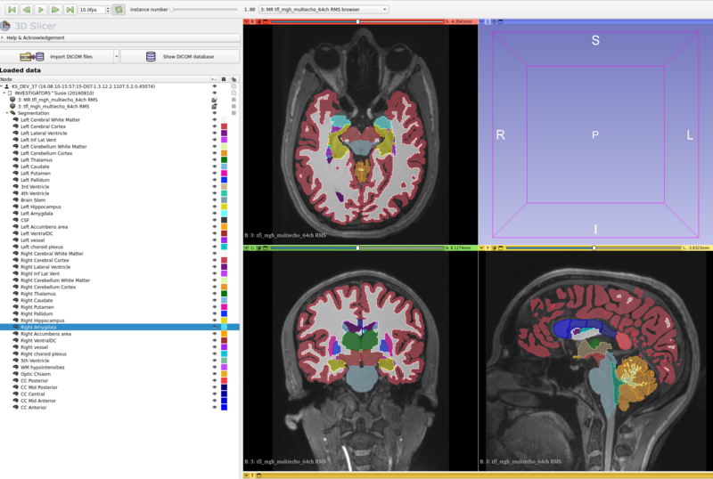

# Python tools for Interoperable Neuromorphometry Reporting
Python tools for Interoperable Neuromorphometry Reporting (`pinr`) allows for the creation of DICOM Structured Reporting Documents and FHIR Diagnostic Report resources from a T1w image processed by the [FreeSurfer](https://surfer.nmr.mgh.harvard.edu/) neuroimaging software suite.

Currently, only [`aseg.mgz`](http://surfer.nmr.mgh.harvard.edu/fswiki/SubcorticalSegmentation/) and `aseg.stats`  are supported and documented. Future versions may support other FreeSurfer segmentations and parcellations (such as thickness and volumes of different cortical regions).

DICOM conversion uses the [highdicom](https://github.com/ImagingDataCommons/highdicom) package, and FHIR JSON files are created with [fhir.resources](https://github.com/nazrulworld/fhir.resources/tree/main).

For each label in the segmentation, a DICOM TID 300 "Measurement" object is created, and each Measurement is contained in a TID 1411 "Volumetric ROI Measurements and Qualitative Evaluations" object. The set of all labels are contained in a "Imaging  Measurement Report" object.

FHIR output is in the form of a `DiagnosticReport` Resource, consisting of `Observation` Resources for each measurement. Specifically, each DICOM TID 300 object is mapped to a "Imaging Measurement" `Observation`, and each "Imaging Measurement" is contained within a "Imaging Measurement Group" `Observation` (analogous to a TID 1411 DICOM object). The "Imaging Measurement Groups" are contained within the `DiagnosticReport`.

The mapping of DICOM SR to FHIR Resource follows the work of the HL7 Imaging Interegration Work Group. Details are provided [here](https://github.com/HL7/dicom-sr), with architecture information provided within this [Implementation Guide](https://build.fhir.org/ig/HL7/dicom-sr/architecture.html).

DICOM Segmentation images created by `pinr` are vieweable within [3D Slicer](https://www.slicer.org/) with the [QuantitativeReporting Extension](https://github.com/QIICR/QuantitativeReporting) installed:



## Installation
`pinr` has no external dependencies apart from Python >= 3.8.
Run the following command for installation:
```
pip install pinr
```

## Usage
`pinr` provides both a Python and Command Line Interface (CLI)

### CLI
An example command to produce all output is shown here:
```
pinr \
  -i /path/to/file.dcm \
  -s /path/to/mri/aseg.mgz \
  -m /path/to/aseg.stats \
  --dcm-seg /path/to/aseg.seg.dcm \
  --dcm-sr /path/to/aseg.sr.dcm \
  --fhir /path/to/aseg.fhir.json \
```

Run `pinr --help` for more options and information!

# Python Library
`pinr` exposes a class called `FreeSurferSeg`, which stores volumetric data and measurements.


To initiate:
```python
t1w_dicom_file = "/path/to/file.dcm"
aseg_file = "/path/to/mri/aseg.mgz"
aseg_stats_file = "/path/to/aseg.stats"
# Choose where to save output files
dicom_seg_output_file = "/path/to/aseg.seg.dcm"
dicom_sr_output_file = "/path/to/aseg.sr.dcm"
fhir_output_file = "/path/to/aseg.fhir.json"

aseg = FreeSurferSeg(
    t1w_dicom_file=t1w_dicom_file,
    aseg_file=aseg_file,
    aseg_stats_file=aseg_stats_file,
    dicom_seg_output_file=dicom_seg_output_file,
    dicom_sr_output_file=dicom_sr_output_file,
    fhir_output_file=fhir_output_file,
)
```
Data is stored as properties of the object, and is written to the given file name if one is provided.

```python
seg = aseg.seg
sr = aseg.sr
fhir = aseg.fhir
```

## Testing
Example data is provided.
After installation, clone the repo and cd into it.
The following command will produce outputs using the provided input files.
These can be compared against the existing output files
```
pinr \
  -i ./tests/data/input/dicom/MR.1.3.12.2.1107.5.2.0.45074.2016081016110642184700287 \
  -s ./tests/data/input/aseg.mgz \
  -m ./tests/data/input/aseg.stats \
  --dcm-seg ./tests/data/output/aseg_new.seg.dcm \
  --dcm-sr ./tests/data/output/aseg_new.sr.dcm \
  --fhir ./tests/data/output/aseg_new.fhir.json
```

## Roadmap
- Improve testing and add CI (in progress)
- Incorporate feedback regarding architecture decisions of DICOM and FHIR outputs
- Formal validation of outputs

----
Work here was supported by the National Institute Of Biomedical Imaging And Bioengineering of the National Institutes of Health under Award Number R43EB030910.
